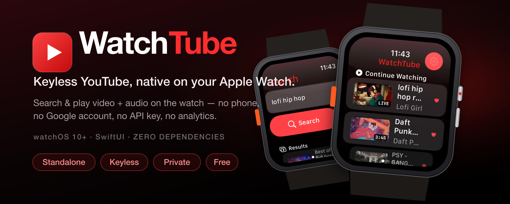
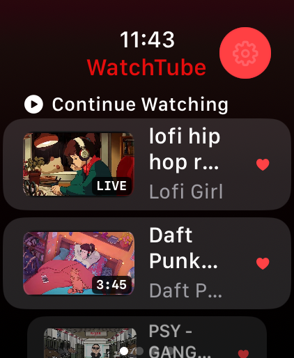
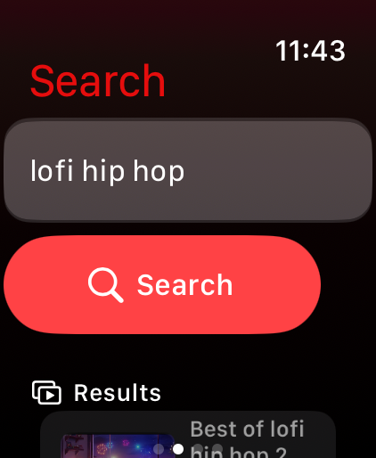
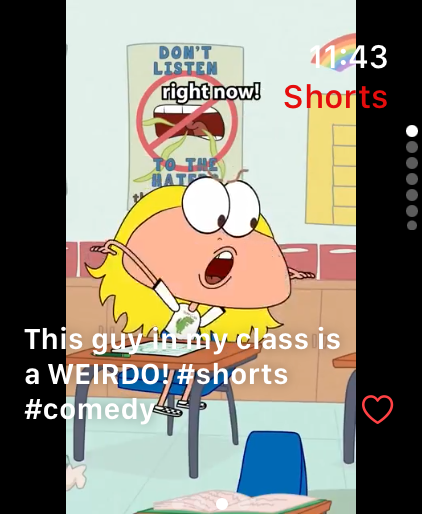
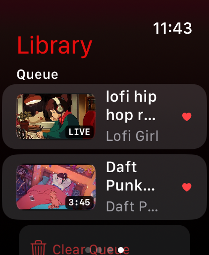
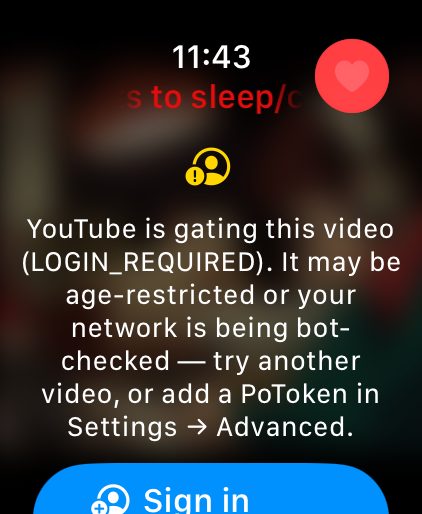
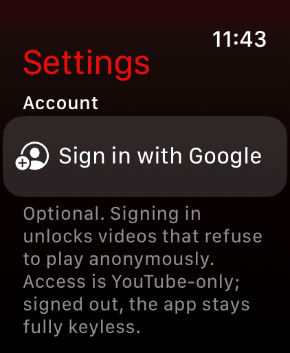

<div align="center">



<h1>WatchTube&nbsp;⌚️&nbsp;▶️</h1>

**A keyless, privacy‑respecting YouTube client for Apple Watch.**
Search and play **video + audio directly on the watch** — no paired iPhone, no Google account, no API key, no analytics.

<br/>


**[Features](#-features)** · **[How it works](#-how-it-works-the-30-second-version)** · **[Install](#-install-on-your-apple-watch--step-by-step)** · **[Security](#-security--privacy-posture)** · **[Layout](#-project-layout)**

</div>

---

<table>
<tr>
<td width="55%" valign="top">

### What is it?

WatchTube is a tiny, self‑contained YouTube client **built for the Apple Watch Ultra** and running on **any watchOS 10+** watch. It talks straight to YouTube from your wrist — search, browse, and stream video **and** audio with **zero** external dependencies and **zero** tracking.

It stays **fully keyless by default**. When YouTube bot‑gates a video, an **optional, YouTube‑scope‑only** Google sign‑in can unlock it — but signed out, everything you see here still works.

</td>
<td width="45%" valign="top">

> ### ⚠️ Honest disclaimer — read this first
>
> WatchTube plays YouTube by talking to YouTube's *internal* **“InnerTube”** API (the same endpoints the official apps use). That is **not** officially sanctioned and **violates YouTube's Terms of Service**.
>
> This is for **personal, sideloaded use only** — don't ship it to the App Store. Treat it as a homebrew client. **You** are responsible for how you use it.

</td>
</tr>
</table>

<p align="center">
  
  
  
  
  
  
</p>
<p align="center"><sub><b>Home · Search · Shorts · Library · Player · Settings</b> — on the Apple Watch Ultra</sub></p>

---

## ✨ Features

| | |
|---|---|
| 🔎 **Keyless search** | Live autocomplete — suggestions as you type, so you barely touch the tiny keyboard. |
| 📲 **Shorts feed** | A dedicated tab; swipe vertically through full‑screen Shorts that play and loop, just like the phone app. |
| ▶️ **Up Next** | Related videos under the player — one tap to keep watching. |
| 👤 **Channel pages** | Tap a creator to browse their uploads, avatar, and description. |
| 🔥 **Trending home feed** | Poster cards on launch, with a graceful fallback so it's never empty. |
| 🎬 **On‑watch video + audio** | Adaptive **HLS** via `AVPlayer` — looks and sounds great, even on cellular. |
| ⏩ **Playback speed & queue** | Speed control plus a play queue for back‑to‑back watching. |
| ❤️ **Favorites · 🕘 History · 🔁 Recent searches** | All stored **on‑device**, never uploaded. |
| 📡 **Data Saver** | Caps bitrate to save cellular data and battery. |
| 🔑 **Optional Google sign‑in** | TV‑style device flow (show a code, approve at `google.com/device`). Scope is **YouTube‑only** and **only ever adds** access — it can never break keyless playback. |
| 🔒 **Private by design** | Keychain‑stored secrets, ATS‑enforced HTTPS, **zero** analytics, **zero** third‑party dependencies. |
| ⌚ **Truly standalone** | Leave your phone at home; runs on the watch alone. Tuned for **Apple Watch Ultra**, works on any watchOS 10+ watch. |

---

## 🛠 How it works (the 30‑second version)

| Step | What happens |
|------|--------------|
| **Search** | `POST youtubei/v1/search` (WEB client); we recursively gather both legacy `videoRenderer` nodes and the newer `lockupViewModel` / `shortsLockupViewModel` cards. |
| **Suggest** | `GET` YouTube's public `complete/search` service for as‑you‑type autocomplete. |
| **Resolve** | `POST youtubei/v1/player` trying **iOS → ANDROID_VR → TVHTML5**, all **keyless first**; the first to return an **HLS `.m3u8`** (or direct progressive URL) wins. iOS yields HLS, ideal for the watch. |
| **Related** | `POST youtubei/v1/next` for the Up Next rail (parsed from `lockupViewModel`). |
| **Sign in** *(optional)* | OAuth **device flow** with YouTube's public TV client. The `Bearer` token is attached **only to an extra TVHTML5 attempt appended after** the keyless ones — so it can unlock account‑gated videos but never breaks working playback. |
| **Play** | `AVPlayer` plays the HLS URL natively — adaptive bitrate, audio + video. |

**The trick:** the iOS/TV InnerTube clients hand back a ready‑to‑play HLS manifest, so we **never** run YouTube's signature‑deciphering JavaScript (which the watch can't do anyway).

> **Reality check (2026).** YouTube increasingly gates stream resolution behind bot‑detection, and Google has **restricted OAuth for InnerTube** — so the keyless clients are the reliable path and sign‑in is a *bonus*, never a crutch. **Search is reliable.** If a video resolves to `LOGIN_REQUIRED` it's usually age‑restricted or your network is being bot‑checked — try another video, or paste a **PoToken + visitorData** into *Settings → Advanced*.

All the fragile stuff lives in two files: [`Sources/Networking/InnerTubeClient.swift`](Sources/Networking/InnerTubeClient.swift) and [`Sources/Auth/GoogleAuth.swift`](Sources/Auth/GoogleAuth.swift).

---

## 📲 Install on your Apple Watch — step by step

This installs WatchTube straight onto your watch so it runs **without your iPhone**. It takes ~15 minutes the first time. **No jailbreak, no developer fee** — a free Apple ID is all you need.

### What you need
- A **Mac** with **Xcode** (free, Mac App Store).
- Your **Apple Watch** (Ultra or any watchOS 10+) **paired to an iPhone**. You still need the iPhone *for setup and trust* — the app itself runs standalone after.
- A **free Apple ID** — no $99 developer account needed.
- **Homebrew** (to install XcodeGen): https://brew.sh

### 1 · Get the tools
```sh
brew install xcodegen        # turns project.yml into an Xcode project
```
Open **Xcode once** and let it finish installing components.

### 2 · Get the code & generate the project
```sh
git clone https://github.com/at0m-b0mb/WatchTube.git
cd WatchTube
xcodegen generate            # creates WatchTube.xcodeproj
open WatchTube.xcodeproj
```

### 3 · Sign it with your Apple ID
1. In the left sidebar, click the blue **WatchTube** project → select the **WatchTube** target → **Signing & Capabilities** tab.
2. Tick **Automatically manage signing**.
3. Set **Team** to your Apple ID. *(No team listed? **Xcode ▸ Settings ▸ Accounts ▸ “+” ▸ Apple ID**, sign in, come back.)*
4. If you see *“bundle identifier is not available”*, change the **Bundle Identifier** to something unique, e.g. `com.yourname.watchtube`.

### 4 · Turn on Developer Mode (one time)
1. **On the iPhone:** Settings ▸ Privacy & Security ▸ **Developer Mode** ▸ On ▸ restart.
2. **On the Watch:** Settings ▸ Privacy & Security ▸ **Developer Mode** ▸ On ▸ restart.
3. Keep the watch **unlocked** and, ideally, **on its charger** during the first install.

### 5 · Run it onto the watch
1. In Xcode's toolbar, click the destination dropdown and pick **your Apple Watch** (not a simulator). First time, Xcode shows *“Preparing watch for development…”* — this can take several minutes. Keep both devices unlocked.
2. Press **▶︎ Run** (**⌘R**). Xcode builds, installs, and launches WatchTube.

### 6 · Trust the developer & launch
1. The first launch may say *“Untrusted Developer.”* On the **watch**: Settings ▸ General ▸ **VPN & Device Management** ▸ tap your Apple ID profile ▸ **Trust**.
2. Open **WatchTube** from your watch's app grid. Done — search and play. 🎉

### 🔄 Keeping it installed (free Apple ID = 7 days)

With a free Apple ID, the app expires after **7 days**. WatchTube shows a countdown in **Settings** (green → yellow → red) so you always know. When it's time, run **one command** from the WatchTube folder:

```sh
./deploy.sh                  # re-builds and installs — takes ~2 minutes
```

Or, in Xcode: just press **⌘R** again.

| Account | Lasts | To renew |
|---------|-------|----------|
| **Free Apple ID** | **7 days** | `./deploy.sh` or ⌘R in Xcode |
| **Paid Apple Developer ($99/yr)** | **1 year** | Re‑sign once a year |

> **Tip:** `./deploy.sh --simulator` runs it in the watch simulator if you just want to try it out without touching your real watch.

<details>
<summary><b>🩺 Troubleshooting</b></summary>

- **Watch isn't in the destination list** → unlock it, put it on the charger, make sure Mac + iPhone + Watch share the same Wi‑Fi/Apple ID, and wait for *“Preparing…”*.
- **“Unable to install”** → make sure Developer Mode is on (Step 4) and your Team is set (Step 3).
- **App opens but a video says `LOGIN_REQUIRED`** → YouTube is bot‑gating your network. Easiest fix: **Settings ▸ Account ▸ Sign in with Google** (the player error screen also offers the shortcut). Or add a **PoToken + visitorData** in **Settings ▸ Advanced** (see [yt‑dlp's PO‑Token guide](https://github.com/yt-dlp/yt-dlp/wiki/PO-Token-Guide)). Search still works regardless.

</details>

### 🖥️ Just want to try it fast? (Simulator)
```sh
xcodegen generate
open WatchTube.xcodeproj         # pick an "Apple Watch Ultra" simulator, press ⌘R
```

---

## 🔧 When it breaks (because it eventually will)

YouTube rotates client versions and tightens access. If search or playback stops, **one file** usually needs attention: [`Sources/Networking/InnerTubeClient.swift`](Sources/Networking/InnerTubeClient.swift).

- **Playback fails / `LOGIN_REQUIRED`** → sign in with Google (*Settings ▸ Account*), bump the **TVHTML5 / iOS / ANDROID_VR** entries in `playbackClients` (their `clientVersion` + `userAgent`) to current values, and/or add a `PoToken` in *Settings ▸ Advanced*.
- **Search returns nothing** → bump `webClientVersion`.
- **Sign‑in stops working** → Google occasionally tightens the TV device flow ([`Sources/Auth/GoogleAuth.swift`](Sources/Auth/GoogleAuth.swift)). If that happens the app just behaves as signed‑out — keyless playback and PoTokens keep working.

There's no key to rotate and nothing tied to your identity — these are public values shipped inside YouTube's own clients. *(Sign‑in is the one exception: that token is yours, it lives in the Keychain, and signing out revokes it.)*

---

## 🔒 Security & privacy posture

- **Sign‑in optional, keyless by default; no analytics.** History/favorites never leave the watch. If you do sign in, the OAuth scope is **YouTube‑only** (never email/contacts/Drive), the tokens live in the Keychain, and **Sign Out** both wipes them and revokes the grant with Google.
- **App Transport Security stays fully ON.** Every endpoint is HTTPS (`www.youtube.com`, `*.googlevideo.com`, `oauth2.googleapis.com`); **zero** ATS exceptions.
- **Secrets in the Keychain**, not `UserDefaults` — encrypted at rest, passcode gated (`AfterFirstUnlock`).
- **No third‑party dependencies.** 100% first‑party Apple frameworks (SwiftUI, AVKit, Security, WatchKit). Nothing to audit but the code in this repo.

---

## 📋 Known limitations

- **Playback resolution is gated by YouTube's anti‑bot system (2026).** Search always works; resolution may return `LOGIN_REQUIRED` depending on your network — residential IPs (your watch on Wi‑Fi/cellular) fare far better than datacenter IPs. When gated, sign in with Google or add a PoToken in Settings.
- **Brittle by nature** — see [*When it breaks*](#-when-it-breaks-because-it-eventually-will).
- **Age‑restricted / some music videos** may need a PoToken.
- **Streaming only** — no offline downloads.
- **Live streams** play via their HLS manifest; DVR/seek behavior varies.

---

## 🗂 Project layout

```
WatchTube/
├── project.yml                     XcodeGen spec (build definition + scheme)
├── deploy.sh                       one-command sideload (free Apple ID refresh)
├── docs/
│   ├── banner.png / banner.svg     README hero (run make_banner.py to rebuild)
│   └── screenshots/                README images
├── App/
│   ├── WatchTubeApp.swift          @main entry point
│   ├── Info.plist                  WKApplication + WKWatchOnly, ATS ON, audio mode
│   └── Assets.xcassets/            app icon + accent color
└── Sources/
    ├── Models/                     Video, StreamResolution, Channel, Comment
    ├── Auth/
    │   └── GoogleAuth.swift        optional Google sign-in (OAuth device flow)
    ├── Networking/
    │   ├── InnerTubeClient.swift   ★ extraction layer — search, player, suggest,
    │   │                             next (related), shorts, channel, account feeds
    │   ├── AppClient.swift         builds a client from saved settings + sign-in
    │   └── APIError.swift
    ├── Security/
    │   └── KeychainStore.swift     encrypted storage for tokens & secrets
    ├── Storage/
    │   └── LibraryStore.swift      favorites / history / recent searches (on-device)
    ├── Support/
    │   ├── Haptics.swift           Taptic Engine helper
    │   ├── Theme.swift             shared backdrop gradient & poster scrim
    │   ├── ProvisioningInfo.swift  free-Apple-ID expiry countdown
    │   └── SampleData.swift        seed data for screenshots (WT_SEED=1)
    ├── ViewModels/                 Search / Home / Player / Shorts / Channel /
    │                                Account (@Observable)
    └── Views/                      Root (tabs), Home, Search, Shorts, Library,
                                    Player, Channel, AccountFeed, Comments,
                                    Description, Settings, GoogleSignIn, SpeedPicker,
                                    VideoRow, VideoCard, Components
```

---

<div align="center">

**Made with ⌚️ + ▶️ by [at0m‑b0mb](https://github.com/at0m-b0mb)**

<sub>Personal project. Not affiliated with, endorsed by, or connected to YouTube or Google. “YouTube” is a trademark of Google LLC.</sub>

</div>
# WatchTube
# WatchTube
# WatchTube
